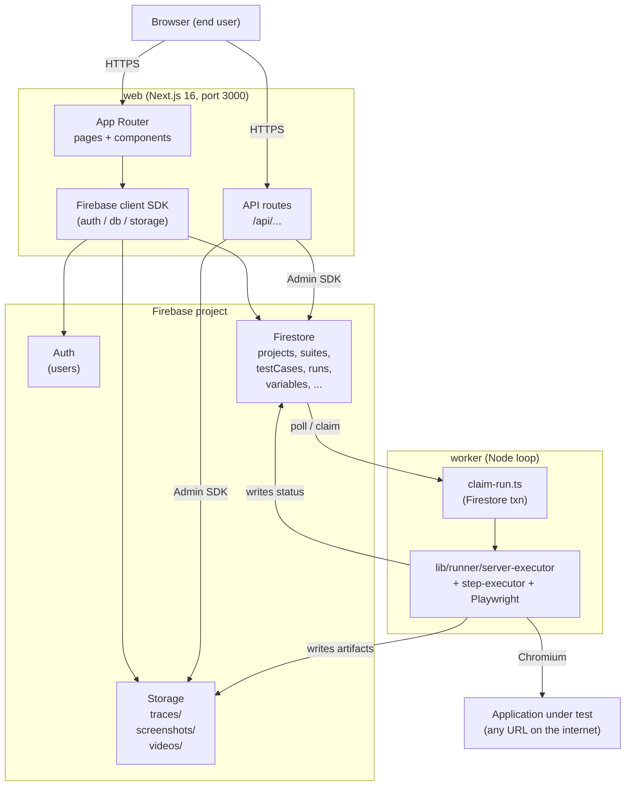

# Architecture

System-level view of OpenAutomate. For module-level dependencies see `module-topology.md`. For Firestore schemas see `data-model.md`. For the run state machine see `run-lifecycle.md`.

## One-page picture

## The two processes

OpenAutomate is **deliberately split into two processes** that share one Firebase project:

### `web`
- Next.js 16 with App Router (`apps/web`).
- Serves the UI and API routes.
- Owns: auth, project/suite/test-case CRUD, variables, members, reports, artifact-access proxy.
- **Queues** runs by writing a `testRuns` doc with `status: 'queued'`.
- Default port `3000`.

### `worker`
- Plain Node loop, started via `tsx` with `dotenv/config` (`apps/web/src/worker/test-run-worker.ts`).
- Polls Firestore every 5 s for `queued` runs and **claims** them in a transaction (lease-based).
- Spawns Playwright Chromium, walks step-by-step, captures screenshots / traces / video, uploads artifacts to Storage, writes status back to Firestore.
- Heartbeats to a singleton `worker-status/test-run-worker` doc so the UI can show "online / idle / running".
- Concurrency: `OPENAUTOMATE_WORKER_CONCURRENCY` (default 1).

### Why two processes
- Playwright spawns Chromium per run — heavyweight, not safe to run inside a Next.js request lifecycle.
- The web process must stay responsive for live status updates while runs execute.
- Decoupling the queue from the executor means runs survive web restarts; you can restart `web` mid-run without aborting the test.

There's a fallback path: `POST /api/runner/execute` calls the *same* `lib/runner/server-executor` from inside the web process. Useful for a forced/admin trigger when no worker is online, but not the default. See `module-topology.md`.

## External dependencies

| What | Purpose | Required? |
|---|---|---|
| Firebase Auth | sign-in, identity | yes |
| Firestore | system of record (everything except artifacts) | yes |
| Firebase Storage | screenshots, videos, traces | yes |
| Playwright (Chromium) | actual browser automation | yes (workers only) |
| Gemini API | AI test-draft generation | optional |

No Postgres, no Redis, no message broker. Firestore plays the role of database **and** queue. The `claim-run.ts` Firestore transaction is the only synchronization primitive between worker(s) and web.

## Self-hosting model

Each deployer:
1. Creates their own Firebase project.
2. Deploys `firebase/firestore.rules`, `firebase/firestore.indexes.json`, `firebase/storage.rules` to it.
3. Sets the same env values on `web` and `worker`.
4. Runs both processes (two Node procs, two containers, or `docker compose up`).

There is no shared SaaS layer. The repo is the whole product.

## Local development substitutes

For local dev without a real Firebase project, the **Firebase Emulator Suite** stands in for Auth + Firestore + Storage. The client SDK auto-routes to emulators when `NEXT_PUBLIC_USE_EMULATORS=true`. The Admin SDK auto-routes when `FIRESTORE_EMULATOR_HOST` / `FIREBASE_AUTH_EMULATOR_HOST` / `FIREBASE_STORAGE_EMULATOR_HOST` are set. Playwright still launches a real Chromium — the emulator only fakes Firebase, not the SUT. See `CLAUDE.md` for the emulator workflow.

## Design choices worth knowing

- **Firestore as queue.** Simple, transactional, and free at this scale. Won't scale to thousands of runs/sec, but that's far beyond MVP.
- **Lease + heartbeat over locks.** A claimed run carries `(workerId, leaseId)`; every executor write asserts ownership. Stale runs (no heartbeat for 15 min) are auto-failed by the worker on its next pass.
- **Artifacts in Storage, metadata in Firestore.** Run docs hold paths (e.g. `traces/<projectId>/<runId>/<testCaseId>.zip`); the actual blobs live in Storage and are served via `/api/artifacts/access` for auth.
- **Step DSL is JSON, not code.** Tests are sequences of `{action, selector, value, ...}` objects in a Firestore doc, not TypeScript. This makes the UI authoring loop possible but caps the expressiveness of a single test.
- **No multi-tenancy.** Each Firebase project = one OpenAutomate instance. Permissions are per-project (owner/viewer), not per-org.
