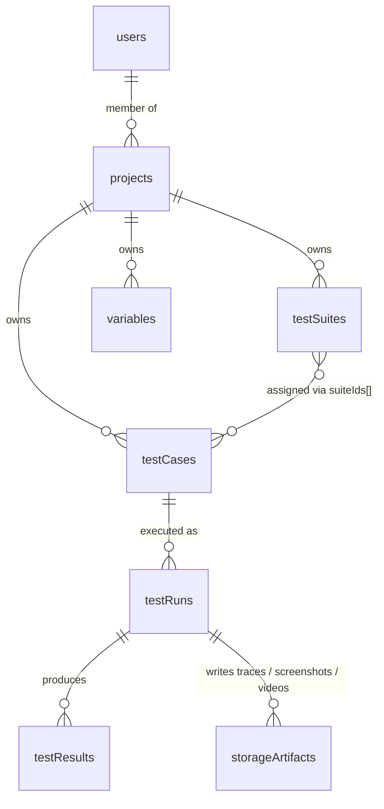

# Data model

Firestore is both the database and the run queue. This is the canonical reference for collections, fields, and how they relate. For the run state machine specifically see `run-lifecycle.md`.

## Collections at a glance

```
users/{userId}                     ── auth profile
projects/{projectId}               ── project + members map
testSuites/{suiteId}               ── grouping inside a project
testCases/{testCaseId}             ── the test definition (steps array)
testRuns/{runId}                   ── one execution; queue + state machine
testResults/{resultId}             ── historical result records (post-completion)
features/{featureId}               ── feature tags / categorization
variables/{variableId}             ── {{KEY}} substitutions, scoped per project
worker-status/test-run-worker      ── singleton heartbeat doc
```

Storage (separate from Firestore):

```
screenshots/<projectId>/<runId>/<testCaseId>_<stepId>.png
traces/<projectId>/<runId>/<testCaseId>.zip
videos/<projectId>/<runId>/<testCaseId>.webm
```

## Relationship sketch



Most relationships are by **`projectId`** field, not by subcollection. Top-level collections + filter-by-projectId is the dominant pattern (works well with Firestore rules and indexes).

## Collection shapes

Field lists below capture what the executor and rules actually depend on. Other UI-only fields exist; treat these as the contract.

### `users/{userId}`
- `email: string`
- `displayName?: string`
- `createdAt: Timestamp`

`{userId}` matches Firebase Auth uid.

### `projects/{projectId}`
- `name: string`
- `baseUrl: string` — application under test
- `ownerId: string` — primary owner (uid)
- `memberIds: string[]` — uids with any access (used for queries)
- `members: { [uid]: { role: 'owner' | 'viewer', email?, addedAt? } }` — role map, the source of truth
- `createdAt`, `updatedAt: Timestamp`

The `memberIds` array exists to make `where('memberIds', 'array-contains', uid)` queries cheap; the `members` map is the authoritative role source. **Both must be kept in sync** — `lib/project-permissions.ts` and the member-management API route do this.

### `testSuites/{suiteId}`
- `projectId: string`
- `name: string`
- `description?: string`
- `order: number` — for UI reordering
- `createdAt`, `updatedAt: Timestamp`

Suites are flat per project today. Nested suites are listed as future work in `README.md`.

### `testCases/{testCaseId}`
- `projectId: string`
- `name: string`
- `description?: string`
- `suiteIds: string[]` — many-to-many with suites
- `steps: Step[]` — see below
- `priority?: 'low' | 'medium' | 'high'`
- `tags?: string[]`
- `status: 'draft' | 'active'`
- `createdAt`, `updatedAt: Timestamp`

#### Step shape

```ts
interface Step {
  id: string;
  action: 'navigate' | 'click' | 'type' | 'wait' | 'assert';
  selector?: string;     // CSS selector (also accepts {{VAR}})
  value?: string;        // URL / input value / wait ms (also accepts {{VAR}})

  // assert-only
  assertionType?: 'visible' | 'hidden' | 'exists' | 'notExists'
                | 'text' | 'value' | 'url' | 'title' | 'attribute';
  expectedValue?: string;
  operator?: 'equals' | 'contains' | 'startsWith' | 'endsWith' | 'matches';
}
```

The executor in `lib/runner/step-executor.ts` is the binding spec. Adding a new action requires editing **that** file plus any UI builders.

### `testRuns/{runId}`

The run state machine lives here. See `run-lifecycle.md` for transitions. Key fields:

- `projectId: string`
- `type: 'test-case' | 'suite'`
- `testCaseId?: string` — when `type === 'test-case'`
- `testCaseIds?: string[]` — when `type === 'suite'`
- `status: 'queued' | 'starting' | 'running' | 'completed' | 'failed' | 'cancelled'`
- `workerId?: string | null` — set on claim
- `leaseId?: string | null` — set on claim, asserted on every executor write
- `attemptCount: number` — incremented when execution starts
- `createdAt`, `startedAt?`, `completedAt?`, `heartbeatAt?`, `updatedAt: Timestamp`
- `cancelRequestedAt?: Timestamp | null` — UI sets this; executor checks between steps
- `error?: string | null`
- `executor?: 'web-server'` — set when in-process executor was used (vs worker)
- `recordVideo?: boolean`
- `logs?: StepLog[]` — for single test-case runs
- `consoleLogs?: ConsoleEntry[]`
- `tracePath?: string | null` — Storage path
- `videoPath?: string | null` — Storage path
- `results?: SuiteCaseResult[]` — for suite runs (one per testCaseId)

#### `StepLog` (per executed step)
```ts
{
  stepId: string | null;
  action: string;
  selector: string | null;
  value: string | null;
  status: 'running' | 'passed' | 'failed';
  timestamp: number;
  duration?: number;
  error?: string;
  screenshotPath?: string;   // set on failure
}
```

#### `SuiteCaseResult` (one entry per case in a suite run)
```ts
{
  testCaseId: string;
  name: string;
  status: 'queued' | 'running' | 'completed' | 'failed' | 'cancelled';
  startedAt?: Timestamp;
  completedAt?: Timestamp;
  logs?: StepLog[];
  consoleLogs?: ConsoleEntry[];
  error?: string | null;
  tracePath?: string | null;
  videoPath?: string | null;
}
```

### `testResults/{resultId}`
Historical result rows for analytics. Written after a run finishes. Kept separate from `testRuns` so reports queries don't pay the cost of in-flight run docs.

### `features/{featureId}`
Feature tags / categorization. Light usage today — exists to support tagging in `testCases`.

### `variables/{variableId}`
- `projectId: string`
- `key: string` — referenced as `{{KEY}}` in step `value` / `selector` / `expectedValue`
- `value: string`
- `createdAt`, `updatedAt: Timestamp`

Loaded once per execution by `fetchProjectVariables(projectId)` in `server-executor.ts`. Substitution is plain string replace via regex `/\{\{([^}]+)\}\}/g`. No nesting, no expressions.

### `worker-status/test-run-worker` (singleton)
- `workerId: string`
- `state: 'idle' | 'claiming' | 'running'`
- `runId: string | null` — first active run
- `runIds: string[]` — all active runs (concurrency > 1)
- `activeRunCount: number`
- `concurrencyLimit: number`
- `heartbeatAt: Date`
- `updatedAt: Date`

`/api/health` reads this to report worker liveness. A `heartbeatAt` older than ~30 s is treated as stale.

## Indexes

Defined in `firebase/firestore.indexes.json`. Most are composite (`projectId` + sort field). When you add a query that filters on more than one field, Firestore will tell you to add an index — capture it in that file and redeploy with `firebase deploy --only firestore:indexes`.

## Security rules

`firebase/firestore.rules` enforces access. Summary:

- `users/{uid}` — readable by self, writable by self.
- `projects/{id}` — readable by anyone in `memberIds`; mutable only by `owner` role; `members` map mutable only by `owner`.
- `testSuites`, `testCases`, `variables` — readable by any project member; writable by owners only.
- `testRuns` — readable by members; writable by owners only (queue + cancel); the executor uses Admin SDK and bypasses rules.
- `testResults` — readable by members; written by Admin SDK (executor) only.
- `worker-status` — readable by members for status display; written by Admin SDK only.

Rules and `lib/project-permissions.ts` must agree. There is an integration test suite in `apps/web/src/integration/firestore.rules.test.ts` that runs against the emulator (`make test-emulator`).

## Things to know before mutating the schema

- **Don't introduce new run statuses** without updating: `server-executor.ts` (writes), the rules file (allow lists), the UI status badges, and the stale-detection cutoff.
- **Don't denormalize lightly.** Firestore charges per document read; UI lists tend to query 50-100 docs per page. Adding a read-heavy field to `testCases` can blow up the dashboard list cost.
- **Migrations are manual.** There's no migration runner. Backfills are scripts you run once with the Admin SDK; commit them under a separate folder if you write any.
