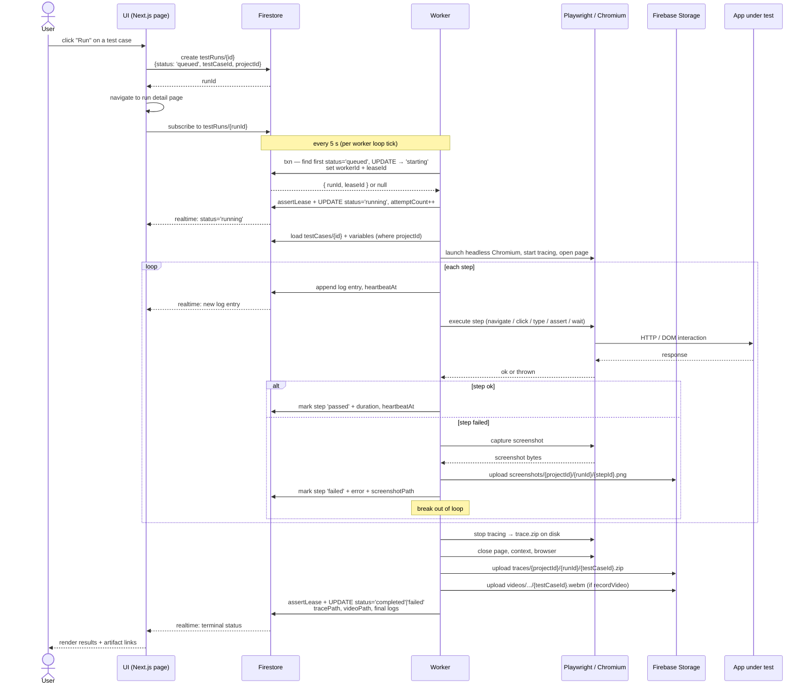
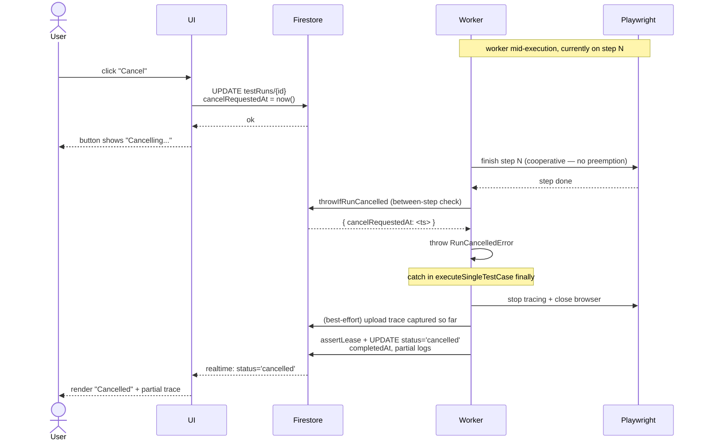
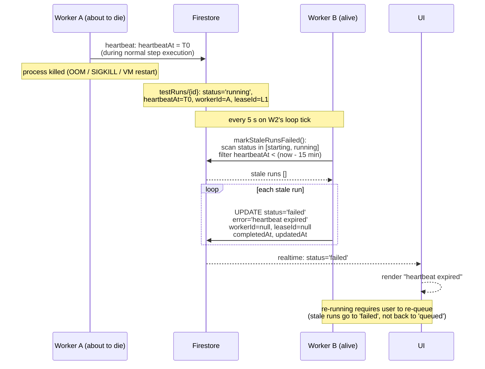
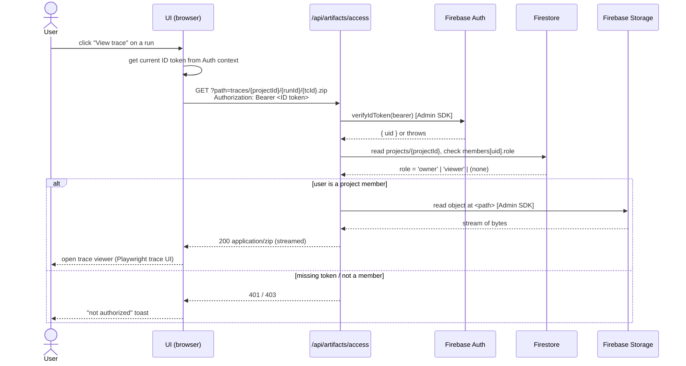

# End-to-end flows

Sequence diagrams for the flows whose choreography is non-obvious. For static views see `architecture.md` (system) and `module-topology.md` (modules). For the run state machine see `run-lifecycle.md`.

The four flows here cover essentially everything load-bearing: queueing + executing a test, cancelling mid-run, recovering from a dead worker, and authenticated artifact access. Trivial flows (login, project create) are not diagrammed — they're a single Firestore write each.

## 1. Run a single test case (the headline flow)

What happens from "user clicks Run" to "user watches the trace." Real-time updates come from Firestore subscriptions on the `testRuns/{runId}` doc.

The lease assertion happens on every Worker → FS write. If the lease was stolen (e.g. via stale-mark, see flow 3), the assertion throws and the executor abandons the run mid-step. The browser is still cleaned up via the `finally` block.

## 2. Cancel a run mid-execution

Cancellation is **cooperative**. The UI sets a flag; the worker checks the flag between steps. A step already in flight (e.g. a slow `assert` waiting for a selector) runs to completion before the cancel takes effect.

If the user cancels while the worker is between steps, the round trip is fast (sub-second). If the worker is mid-step on a long `wait` action, the cancel takes effect when that step's promise resolves. There is no "kill the browser now" path — adding one would risk leaking processes.

## 3. Stale-run cleanup (worker died mid-run)

When a worker process dies (SIGKILL, OOM, machine restart), its in-flight run is stuck in `running` with no one to update it. The next worker tick — by *any* live worker — runs `markStaleRunsFailed()` and reaps it.

Two non-obvious details:
- **Any worker reaps any stale run.** Recovery does not require the original worker to come back.
- **Stale runs do not auto-retry.** Clearing `workerId`/`leaseId` *and* setting status='failed' means they're terminal; the user re-queues manually. This is intentional: auto-retry of a run that may have side-effected (filled a form, made an API call) is unsafe by default.

## 4. Authenticated artifact access (trace / screenshot / video)

Storage paths are not publicly readable. The UI proxies all artifact reads through `/api/artifacts/access`, which verifies the user's ID token, checks project membership, and streams the bytes from Storage via the Admin SDK.

The path is also validated against `lib/server/artifact-paths.ts` to make sure callers can't request arbitrary objects (e.g. `path=../../another-project/...`). Path validation belongs to the API route — Storage rules are a backstop, not the primary enforcement.
