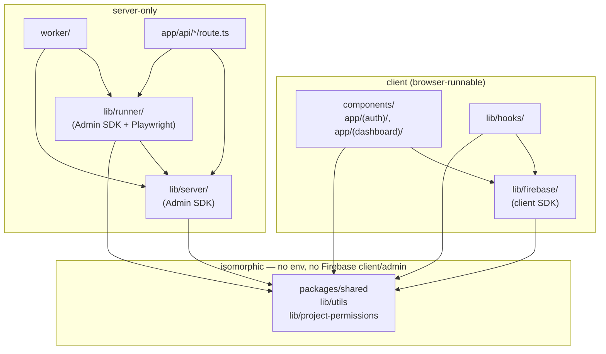

# Module topology

How the code is laid out and which module is allowed to import which. For the runtime/system view see `architecture.md`.

## Workspaces

Two npm workspaces in a Turborepo:

```
apps/web/              # the Next.js app + API + worker entrypoint (one workspace)
packages/shared/       # types + constants + utils, isomorphic
```

`packages/shared` is consumed by `apps/web`. There is no cross-app dependency the other way; nothing in `packages/shared` knows about Firebase, Next.js, or Playwright.

## Module map (`apps/web/src/`)

```
app/                          ── Next.js App Router (pages + API routes)
├── (auth)/                       login, signup
├── (dashboard)/                  authenticated UI
├── docs/                         /docs page (in-app user docs)
├── api/                          server-only HTTP endpoints
│   ├── ai/generate/              POST: Gemini-backed draft generation
│   ├── artifacts/access/         GET:  authenticated artifact proxy
│   ├── health/                   GET:  /api/health
│   ├── import/json/              POST: import test cases from JSON
│   ├── projects/members/         POST/DELETE: manage owners/viewers
│   └── runner/execute/           POST: in-process executor (fallback path)
├── layout.tsx, page.tsx, providers.tsx, globals.css
│
components/                   ── React UI
├── ui/                           primitives (Button, Input, Dialog, ...)
├── forms/, layout/, dashboard/, suites/, test-cases/
│
lib/
├── firebase/                 ── client SDK boundary  (browser-runnable)
│   ├── config.ts                 initializeApp + emulator wiring
│   ├── auth-context.tsx          React context for current user
│   ├── admin.ts                  ⚠ server-only (Admin SDK init)
│   └── index.ts
├── server/                   ── server-only helpers
│   ├── env.ts                    REQUIRED env validation
│   ├── auth.ts                   verify ID tokens server-side
│   ├── artifacts.ts              signed/proxied artifact reads
│   ├── artifact-paths.ts         path-builder for Storage keys
│   └── worker-status.ts          read/write worker-status singleton doc
├── runner/                   ── server-only Playwright executor
│   ├── server-executor.ts        the run/suite execution loop
│   ├── step-executor.ts          one step → one Playwright call
│   └── run-lease.ts              lease ownership + stale detection
├── hooks/                    ── React hooks (client)
├── utils/                    ── pure helpers (isomorphic)
├── project-permissions.ts    ── owner/viewer model (mirrors firestore.rules)
└── constants.ts
│
worker/                       ── Node worker process entrypoint
├── test-run-worker.ts            poll → claim → execute loop
├── claim-run.ts                  transactional claim (queued → starting)
└── claim-run.test.ts
│
integration/                  ── Firestore rules tests (vitest + emulator)
└── firestore.rules.test.ts
```

## Layer rules (the boundaries that matter)

Arrows = "may import from". Anything else is a violation.



Hard rules:

1. **No client → server imports.** Anything under `components/`, `app/(auth)/`, `app/(dashboard)/`, or `lib/hooks/` MUST NOT import from `lib/server/`, `lib/runner/`, `lib/firebase/admin`, or `worker/`. Doing so will either bundle Admin SDK creds into the browser bundle or break the build.
2. **No server-only → client imports.** `lib/server/` and `lib/runner/` MUST NOT import React, Next.js client hooks, or anything from `lib/hooks/`. Server modules should be node-runnable in isolation (the worker proves this).
3. **`packages/shared/` is isomorphic.** It cannot reach for `process.env`, the `firebase` SDK, or `firebase-admin`. Pure types/constants/utils only.
4. **`lib/project-permissions.ts` is a contract, not a fortress.** It encodes the same rules as `firebase/firestore.rules`. Both must agree. Server enforcement lives in the rules file; client checks here are for UI affordances only.

## Shared module: `lib/runner/`

The executor is shared between two callers:

- **`worker/test-run-worker.ts`** — the default path. Polls, claims, executes. Production setup.
- **`app/api/runner/execute/route.ts`** — an HTTP-triggered fallback that runs the same `executeTestRun` inside the web process. Useful when no worker is online or for forced re-execution. Same lease semantics apply, so a worker and an admin trigger can't double-execute the same run.

If you change `server-executor.ts`, both call sites are affected.

## Process boundaries

| Process | Entrypoint | Imports it depends on |
|---|---|---|
| `web` (Next.js) | `apps/web` (next dev/start) | `app/`, `components/`, `lib/firebase/*`, `lib/server/*`, `lib/runner/*` (via API route), `lib/hooks/`, `lib/project-permissions`, `lib/utils`, `packages/shared` |
| `worker` (Node) | `apps/web/src/worker/test-run-worker.ts` | `lib/firebase/admin`, `lib/server/env`, `lib/server/worker-status`, `lib/runner/*`, `worker/claim-run`, `packages/shared` |

The worker binary is **not** a build artifact of Next.js — it's run via `tsx` with `dotenv/config` (see `apps/web/package.json`'s `worker` script). It does not bundle React, the App Router, or any client code.

## Module → external dependency cheat sheet

| Module | External deps |
|---|---|
| `lib/firebase/config.ts` | `firebase` (client SDK) |
| `lib/firebase/admin.ts` | `firebase-admin` |
| `lib/server/*` | `firebase-admin` |
| `lib/runner/server-executor.ts` | `firebase-admin`, `playwright` |
| `lib/runner/step-executor.ts` | `playwright` (types only) |
| `worker/*` | `firebase-admin` (transitively via `lib/*`), `tsx`, `dotenv` |
| `app/api/ai/generate/route.ts` | `@google/generative-ai` |
| `app/api/import/json/route.ts` | `cheerio` (HTML parsing for imports) |
| `components/*`, `app/*` | `next`, `react`, Tailwind, Radix-style primitives |

## Dependency churn risks

- Anything that imports `lib/runner/` indirectly drags in `playwright`. Never re-export `lib/runner/` from a module reachable by client code.
- `lib/firebase/admin.ts` lives under `lib/firebase/` for historical reasons but is **server only**. The tree could be cleaner with this moved into `lib/server/admin.ts`. Out of scope for MVP, but worth doing if the boundary causes a misimport.
- `packages/shared` currently re-exports everything from `types/`, `constants/`, `utils/`. Keep an eye on bundle size; if a heavy util sneaks in, the whole bundle inherits it.
