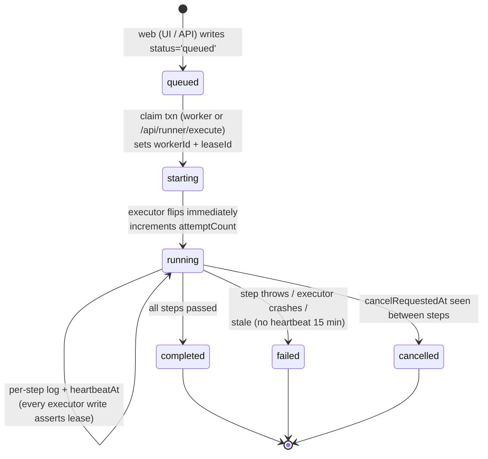

# Run lifecycle

How a run flows from "click Run" to a terminal status, with all the synchronization details. Reading this saves you from re-deriving why the executor does N rule-asserting writes per step.

## State machine



Every transition past `queued → starting` is gated on **lease ownership**: every executor write asserts `runData.workerId === lease.workerId && runData.leaseId === lease.leaseId`. If the lease is broken, the write throws and the executor abandons the run.

## Producers and consumers

| Step | Code | Process |
|---|---|---|
| Enqueue | UI calls / API writes a `testRuns` doc with `status: 'queued'` | web |
| Claim | `worker/claim-run.ts` Firestore txn | worker |
| Execute | `lib/runner/server-executor.ts` | worker (default) or web (via `/api/runner/execute`) |
| Cancel-request | UI sets `cancelRequestedAt` on the run doc | web |
| Stale-mark | `markStaleRunsFailed()` — runs each loop tick | worker |

## Claim (queued → starting)

Code: `apps/web/src/worker/claim-run.ts`.

```ts
db.runTransaction(async (txn) => {
  const snap = await txn.get(
    db.collection('testRuns').where('status', '==', 'queued').limit(1)
  );
  if (snap.empty) return null;

  const next = snap.docs[0];
  if (next.data().status !== 'queued') return null;  // raced

  const leaseId = randomUUID();
  txn.update(next.ref, {
    status: 'starting',
    workerId,
    leaseId,
    // ... timestamps
  });
  return { runId: next.id, leaseId };
});
```

Why a transaction: Firestore guarantees the `update` only commits if the doc hasn't changed since the read. Two workers racing for the same run → at most one wins. The other's transaction retries (or returns `null`).

The worker can claim up to `OPENAUTOMATE_WORKER_CONCURRENCY` runs in parallel; each claim is its own txn.

## Execute (starting → running → terminal)

Code: `apps/web/src/lib/runner/server-executor.ts`.

Sequence per **single test case**:

1. **Re-assert lease** in `starting`. Bail if a different worker now owns it.
2. Flip `starting → running`, increment `attemptCount`, stamp `executor` and `heartbeatAt`.
3. Load `variables` for the project (one Firestore query).
4. Launch headless Chromium, start tracing, open a Page, attach console listener.
5. For each step in order:
   - Re-check `cancelRequestedAt` (cooperative cancel point).
   - Substitute `{{VAR}}` in `selector` / `value`.
   - Append a `running` log entry, write `logs` + `heartbeatAt` to Firestore.
   - Run the step via `step-executor.ts` (Playwright call).
   - On success → mark log entry `passed` + duration; loop.
   - On failure → mark `failed` + capture screenshot + upload to Storage + break.
6. Stop tracing, close page/context. Upload trace zip and (optional) video to Storage.
7. Write the terminal status (`completed | failed | cancelled`), `error`, final `logs`, `tracePath`, `videoPath`.
8. Close the browser.

For **suite runs**, the same case-level flow happens for each `testCaseId` in `runData.testCaseIds`, with results accumulated in `runData.results[i]`. The suite stops marking subsequent cases `cancelled` if a cancel is requested, but does **not** stop on the first failure (suites run all cases regardless; suite-level status is `failed` if any case failed).

### Per-step Firestore writes
Every step does ~3 writes: enter (`running` entry), exit (status update), heartbeat. With 10 steps that's 30 doc writes per case, plus screenshots + trace + video on completion. This is fine at MVP scale; if write costs ever matter, batching log entries per N steps is the lever.

## Cancel

The UI writes `cancelRequestedAt: Timestamp.now()` to the run doc (allowed by rules for the project owner). The executor checks this **between steps** in `throwIfRunCancelled`. On detection it throws `RunCancelledError`; the surrounding handler writes the terminal `cancelled` status and uploads any artifacts captured so far.

Cancel is **cooperative, not preemptive**. A step already in flight (e.g. a 30-second `wait`, a slow `assert`) will run to completion before the cancel takes effect. There is no Chromium teardown on demand.

## Heartbeat & stale detection

The executor stamps `heartbeatAt` on the run doc on every per-step write. Separately, the worker writes a singleton `worker-status/test-run-worker` doc each poll tick.

`markStaleRunsFailed()` runs at the start of every worker loop tick. It scans all runs in `starting | running` whose `heartbeatAt` (or `startedAt` as fallback) is older than `RUN_STALE_TIMEOUT_MS` (15 min) and writes:

```ts
{
  status: 'failed',
  error: 'Run marked failed after executor heartbeat expired',
  workerId: null,
  leaseId: null,
  completedAt, updatedAt
}
```

Clearing `workerId` + `leaseId` means a stale run can't be resumed by its original executor (lease assertion will fail) but **also** cannot be re-claimed (status is `failed`, not `queued`). To retry, the user re-queues it from the UI.

## /api/runner/execute (the in-process fallback)

A second entry point into the same `server-executor.ts`. Posting to this route has the web process claim and execute a run instead of the worker. Same lease semantics; a worker and the API can't double-execute. Useful when:

- No worker is running and a single ad-hoc run is needed.
- An admin wants to force-run a run that's been sitting in `queued`.

Don't use it as the primary execution path — Next.js request lifecycles aren't a great fit for browser tests, and the worker path scales by adjusting `OPENAUTOMATE_WORKER_CONCURRENCY`.

## Failure modes worth knowing

| Symptom | Cause | Where to look |
|---|---|---|
| Run stays in `queued` forever | No worker online (or all at concurrency limit) | `/api/health` worker block; `make dev` log |
| Run flips to `failed` with "heartbeat expired" | Worker died mid-run, or step blocked > 15 min | Worker logs around `heartbeatAt`; consider raising `RUN_STALE_TIMEOUT_MS` |
| Run completes but trace/video missing | Storage rules not deployed, or bucket env mismatch | `firebase/storage.rules`, `NEXT_PUBLIC_FIREBASE_STORAGE_BUCKET` |
| `Run lease is no longer owned by this worker` | Claim got stolen — usually two workers with same workerId, or stale-mark cleared lease | `OPENAUTOMATE_WORKER_ID` env, recent stale events |
| Cancel ignored | Cancel only checked between steps; long step in flight | Wait it out, or kill the worker process |

## Invariants to preserve when changing the executor

1. **Lease ownership is asserted on every write.** Never skip the assert "just for a heartbeat update."
2. **Cancel checks happen between steps.** If you add intra-step async work, add a check there too.
3. **Status only moves forward.** `running → queued` or `failed → running` will break stale detection and the UI.
4. **Heartbeat must be set on every meaningful write.** Otherwise stale detection will kill a healthy long run.
5. **Artifacts are best-effort.** Trace/video upload failures must not change the run status — they're caught and logged.
